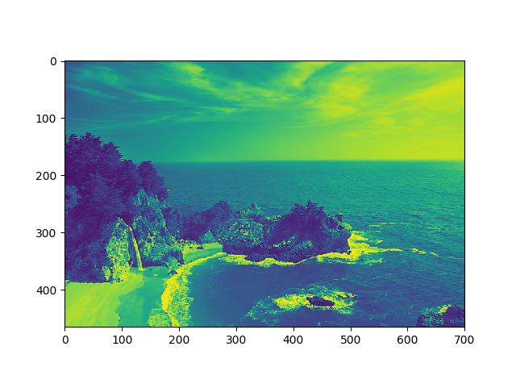
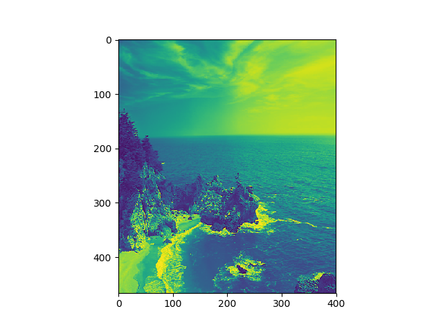
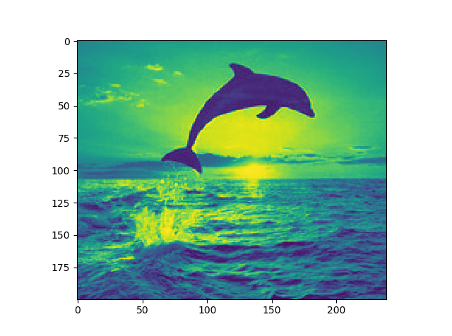
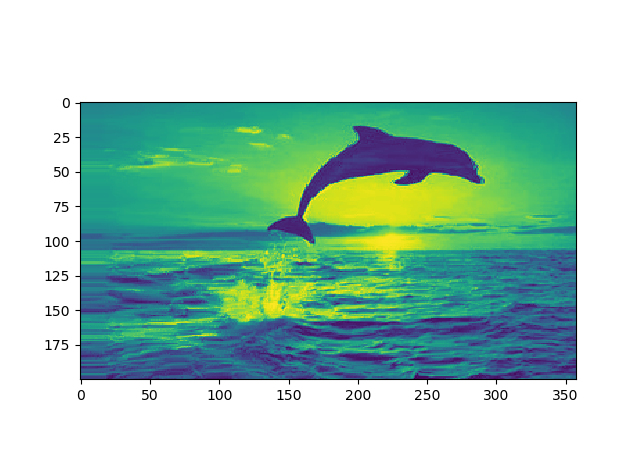

# Seam-Carving for Content-Aware Image Resizing  
  
## Introduction  
Reproducing the paper "Content-aware image resizing" by Shai-Avidan et al. Using the seam carving algorithm, three images are subject to: (1) aspect ratio change by seam removal, (b) aspect ratio change by seam insertion, and (c) aspect ratio change by optimal retargeting.  
  

## Results  
Sample Original Image:  
  
Original Image Reduced in with by 300 pixels:  
  
Sample Original Image:  
  
Original Image Expanded in with by 50%:  
  
Summary:  
  
